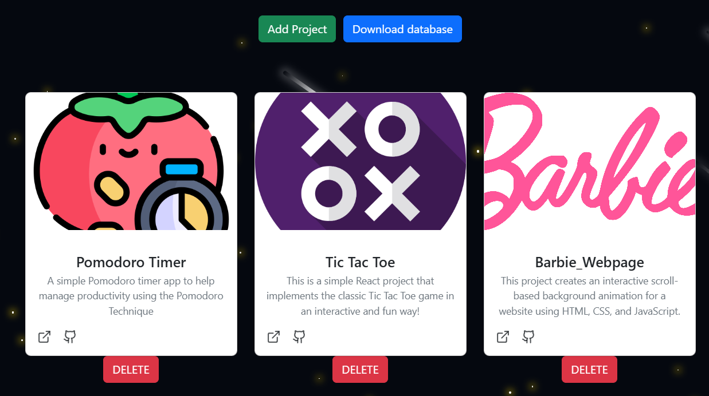

### Beatriz Alves's Porfolio

This project was done in `React with Typescript` and `bootstrap` for styling.

The database of this project is in `SQlite`. To use it in `React`, was installed the `sql.js` library. In order to use that library in this project was also necessary to use `craco`, a configuration layer for `create-react-app`.

Locally we can edit the projects that appear in the projecs section like this.


These buttons only can appear locally not in the published version of the website, that's why in the code we have this:

```js
function isPageLocal() {
  if (window.location.hostname === "localhost") {
    return true;
  } else return false;
}
```

Once we finished the edit we just have to download the database file and place it inside the public folder of the project (deleting the previous ".db" file in that folder).

Then to the changes take effect we need to stop our project and do `npm run build` check if there are any errors and if not `npm run start` to start again our project and check if the new projects appear in the page.

In package.json this scripts config was changed to:

```json
"scripts": {
    "generate-manifest": "node generate-db-manifest.js",
    "prebuild": "npm run generate-manifest",
    "start": "craco start",
    "build": "craco build",
    "test": "craco test --env=jsdom",
    "eject": "craco eject"
  },
```

The generate-db-manifest.js file just reads all the files in the public folder and searches for a file that starts with "projects" in its name and ends in ".db", if the file is found it then generates a json file named "projects-manifest.json" with the name of the file inside an "database" array, like this:

```json
{
  "databases": ["projects_2025-06-26_16_27.db"]
}
```

This is useful for then. in the code, load the correct file like this in the loadDb.tsx (or to in the future to have other database files and only load the ones we want) :

```typescript
const manifestResponse = await fetch(
  `${process.env.PUBLIC_URL}/projects-manifest.json`
);
const manifest = await manifestResponse.json();

const dbFilename = manifest.databases.find((name: any) =>
  name.startsWith("projects")
);
if (!dbFilename) throw new Error("No projects DB found");

const response = await fetch(`${process.env.PUBLIC_URL}/${dbFilename}`);
```
